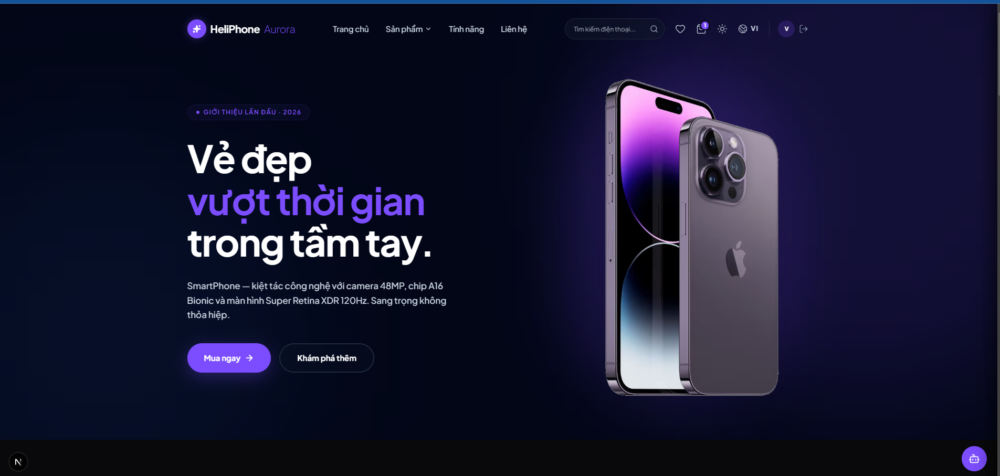
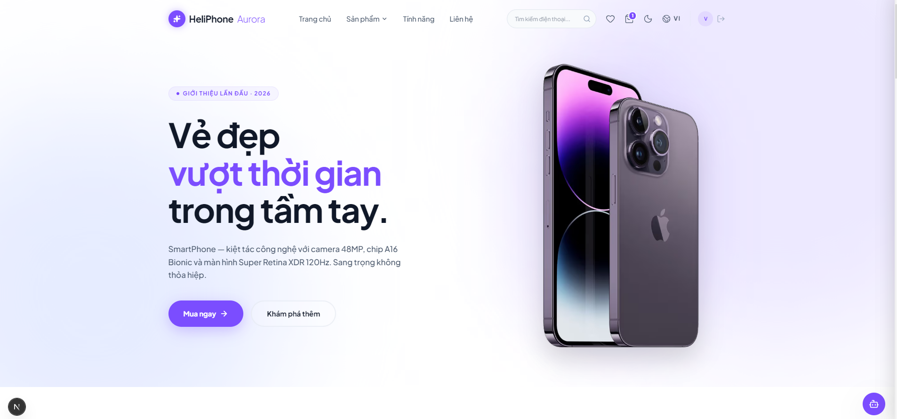
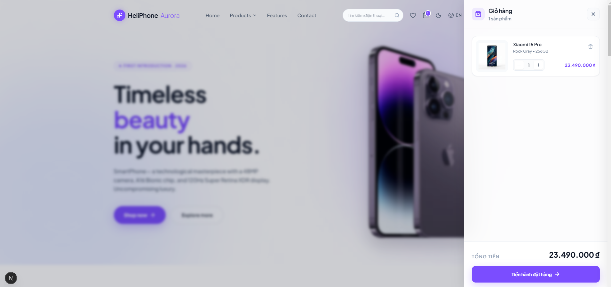
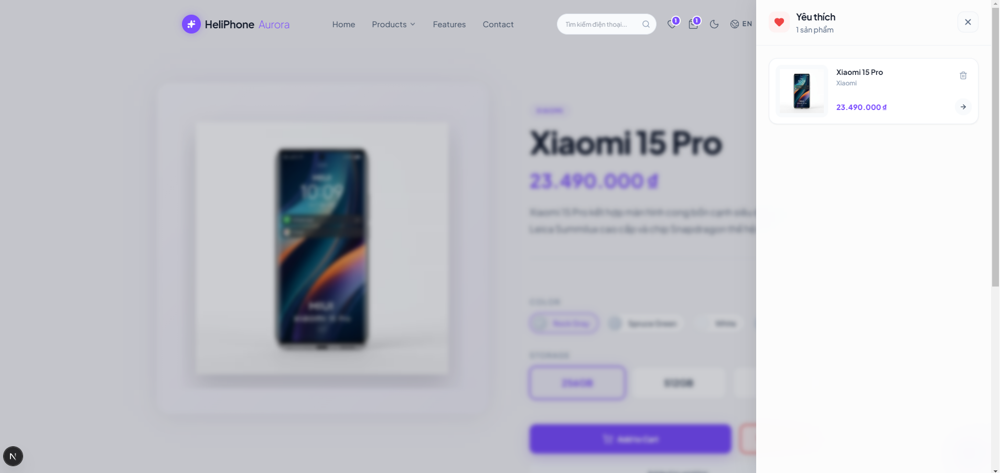
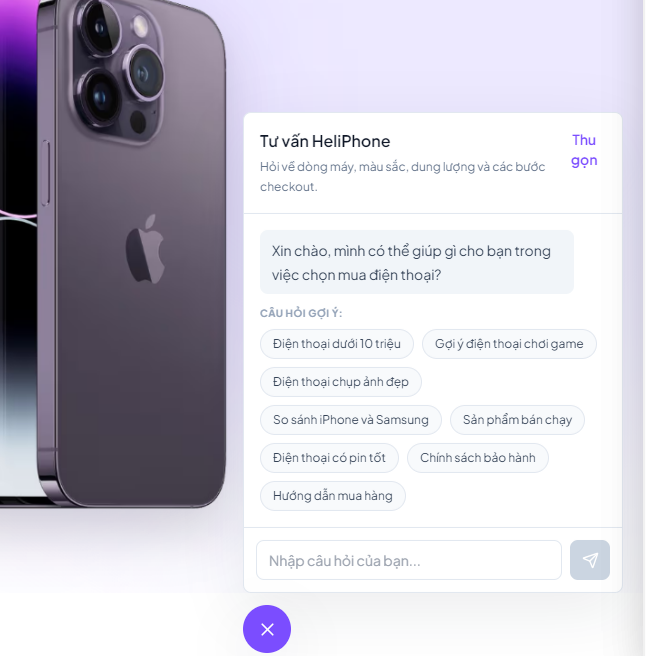

# HeliPhone Aurora

Dự án Landing Page và E-commerce cao cấp dành cho sản phẩm điện thoại thông minh HeliPhone Aurora. Giao diện được thiết kế hiện đại, mượt mà (glassmorphism, animations) với khả năng đáp ứng đa ngôn ngữ và chế độ sáng/tối.

## Công nghệ sử dụng

### Frontend


### Backend


---

## Hình ảnh giao diện

**1. Trang chủ (Hero Section)**

<!-- CHÈN ẢNH TRANG CHỦ VÀO DƯỚI DÒNG NÀY -->




**2. Giao diện Giỏ hàng (Cart Drawer)**


**3. Giao diện Yêu thích (Wishlist Drawer)**


**4. danh sách sản phẩm**


**5. Chatbot**


---

## Tính năng nổi bật

- **Giao diện hiện đại cao cấp**: Hỗ trợ đầy đủ Light/Dark mode, hiệu ứng mờ kính (Glassmorphism), thiết kế chuẩn Apple-like.
- **Đa ngôn ngữ (i18n)**: Tích hợp `next-intl` cho phép chuyển đổi nhanh chóng giữa Tiếng Việt và Tiếng Anh.
- **Quản lý trạng thái (Zustand)**: Giỏ hàng, Danh sách yêu thích và Xác thực người dùng được lưu trữ cục bộ và đồng bộ mượt mà.
- **Trải nghiệm mua sắm**: Tích hợp các menu trượt (Drawers) tiện lợi cho việc quản lý Cart và Wishlist.
- **Trợ lý ảo (Chatbot)**: Tích hợp Chatbot tư vấn thông minh giúp người dùng dễ dàng lựa chọn sản phẩm và giải đáp thắc mắc.
- **Animation (GSAP & Tailwind)**: Trải nghiệm cuộn trang (Scrollytelling) và các micro-animations tinh tế.

## Cấu trúc thư mục

Dự án được cấu trúc theo dạng Monorepo với NPM Workspaces:

```text
helicorp-landing/
├── frontend/             # Next.js App Router (Giao diện người dùng)
├── backend/              # Express API (Xử lý dữ liệu, MongoDB)
└── package.json          # Quản lý Workspaces cho cả frontend và backend
```

## Hướng dẫn cài đặt và chạy nội bộ

**1. Cài đặt các gói thư viện (Dependencies)**

```bash
npm install
```

**2. Cấu hình biến môi trường**
Sao chép các file `.env.example` thành `.env` tương ứng:

```bash
cp backend/.env.example backend/.env
cp frontend/.env.example frontend/.env.local
```

**3. Khởi tạo dữ liệu mẫu (Sản phẩm)**

```bash
npm run seed
```

**4. Khởi chạy dự án**

Mở 2 cửa sổ terminal và chạy lần lượt các lệnh sau:

Chạy Backend (API Server):

```bash
npm run dev:backend
```

Chạy Frontend (Giao diện web):

```bash
npm run dev:frontend
```

Ứng dụng sẽ khả dụng tại: `http://localhost:3000`
